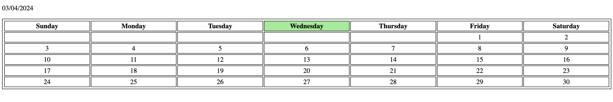

Progress App

iOS repository: https://github.com/nikhilkulkarni1755/progress

Build Habits by Building a Daily Streak

Work Daily on Goals which you value by measuring your progress with this app

1) Choose your Daily Goals

2) Create Account/Sign in

3) Create a Goal 
    - Take a Picture of what you are working on and assign it.
    - mark the days you worked on it. 

4) Track Status

5) Email Updates
    - Opt in to get email updates about when your streak expires, weekly stats etc.

    